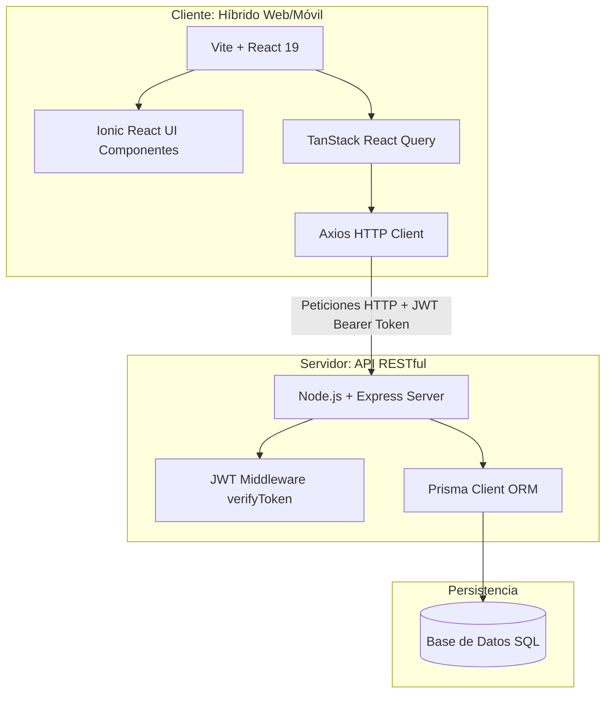

# Proyecto de Ingeniería Web y Móvil: "Fomento de la cultura y el patrimonio local"

**Integrantes:** Nicolas Soto, Agustin Tapia, Ignacio Carrillo, Julian Toro

**Curso:** ICI 4247-1

**Grupo:** 19

# Tabla de Contenidos

1. [Introducción al proyecto](#introducción-al-proyecto)
2. [Justificación del Problema](#justificación-del-problema)
3. [Análisis del Usuario Objetivo](#análisis-del-usuario-objetivo)
4. [Requerimientos del Sistema](#requerimientos-del-sistema)
5. [Arquitectura del Sistema](#arquitectura-del-sistema)
6. [Arquitectura de Navegación y UX](#arquitectura-de-navegación-y-ux)
7. [Instrucciones de Ejecución](#instrucciones-de-ejecución)


# Introducción al proyecto
 
## Contexto
El trabajo que se presenta en este documento surge del análisis de la publicación "Buenas prácticas de Participación Ciudadana en la Gestión Municipal"  por parte de la Subsecretaría de Desarrollo Regional y Administrativo (SUBDERE) en el año 2024. Esta publicación digital presenta 32 iniciativas de buenas prácticas de participación ciudadana en municipios de todo el país que sirven como herramienta de referencia para lograr una gestión municipal más inclusiva y participativa.

A partir de la investigación del documento, se identificó cierta problemática en algunos municipios: la falta de herramientas digitales que visibilicen y promuevan el patrimonio cultural local, los oficios tradicionales y las ferias comunitarias de forma didáctica, con información centralizada y accesible para todos los ciudadanos.

## Objetivo General
El objetivo es desarrollar una plataforma web y móvil que conecte al municipio local con las organizaciones culturales y la ciudadanía en el contexto del patrimonio y ferias tradicionales de la comuna, con enfásis en la participación ciudadana y facilidad de acceso en la gestión municipal cultural.

## Objetivos Específicos
- Visibilizar el patrimonio cultural, trabajos tradicionales y ferias locales de una comuna mediante un catálogo digital interactivo.
- Centralizar la agenda de ferias y eventos culturales de la comuna en una sola plataforma digital.
- Facilitar la participación ciudadana mediante propuestas, votaciones y valoraciones sobre iniciativas culturales locales.
- Digitalizar el proceso de postulación y seguimiento de fondos culturales municipales.
- Promover la transparencia en la gestión cultural municipal mediante indicadores públicos y accesibles

## Alcance
La plataforma está diseñada para ser implementada en cualquier municipalidad de Chile, con especial consideración para comunas rurales y/o mixtas donde la identidad cultural local es menor y existe una necesidad de digitalización de procesos administrativos dentro de un municipio.

# Justificación del Problema

## Problema General
Algunas municipalidades de Chile carecen de herramientas digitales que promuevan el patrimonio cultural y ferias locales de su comuna, especialmente aquellas ubicadas en zonas rurales y con poco acceso a tecnologías actuales, lo que a su vez dificulta la participación ciudadana y la gestión cultural municipal.

## Evidencias del Problema
El análisis del documento de la SUBDERE evidencia algunas brechas, como por ejemplo:

| Problemática | Evidencia |
|-----------|-----------|
| Desconocimiento ciudadano | El 42,5% de los ciudadanos tiene un bajo conocimiento de iniciativas municipales (San Pedro de la Paz, Región Bío-Bío, 2023) |
| Falta de información territorial | La iniciativa menciona la "Escasa información territorial para toma de decisiones" (San Pedro de Atacama, Región Antofagasta, 2020) |
| Baja asociatividad | La iniciativa reconoce una "Falta de asociatividad entre actores involucrados" en el sector cultural (San Pedro de Atacama, Región Antofagasta, 2020) |
| Ausencia de la identidad local | Un diagnóstico reconoce la ausencia de identidad local definida (San Pedro de Atacama, Región Antofagasta, 2020) |
| Acceso desigual | El 68,75% de las buenas prácticas se concentra en comunas urbanas, dejando rezagadas a las rurales y mixtas |
| Transparencia limitada | Las iniciativas de transparencia en gestión municipal solo representan el 21,88% de las prácticas documentadas |


## ¿Por qué una plataforma digital web para solucionar el problema?
- El documento base se refiere a las plataformas digitales como el mecanismo de participación de mayor crecimiento post-pandemia y también debido a la socialización y masificación de este tipo de medios.
- El uso de TICs aparece en el 18,75% de las buenas prácticas como mecanismo clave (revisar gráfico n°3 del documento).
- Permite alcanzar a grupos que no participan presencialmente de forma concurrente (ej: jóvenes, personas cuidadoras, habitantes de sectores alejados, tercera edad, entre otros).
  
# Análisis del Usuario Objetivo

## Roles del Sistema
La plataforma tiene dos roles principales:

### Rol 1: Ciudadano

#### Descripción General
El Ciudadano puede ser un vecino, turista o cualquier tipo de persona que accede a la página para descubrir, participar y calificar el patrimonio cultural de la comuna. Es necesario autenticarse en la plataforma para identificarse y realizar acciones interactivas (RUT + Clave Única).

#### Tipos de Ciudadano
| Tipo | Características | Necesidad Principal |
|----------|----------------|---------------------|
| Vecino residente | Vive en la comuna, conoce la cultura local | Informarse sobre eventos y ferias cercanas |
| Artesano / cultor | Practica un oficio tradicional | Visibilizar su trabajo y postular a fondos |
| Dirigente comunitario | Representa a una organización cultural | Gestionar postulaciones y proponer iniciativas |
| Turista | Visita la comuna temporalmente | Descubrir patrimonio y agenda cultural |
| Joven / estudiante | Baja participación presencial histórica | Participar digitalmente en decisiones culturales |
| Adulto mayor | Puede tener baja alfabetización digital | Acceder a información con interfaz simple |

#### Características del Contexto
- Acceso principalmente desde smartphone.
- Conectividad variable (estable en zonas urbanas, limitada en sectores rurales).
- Nivel de alfabetización digital: heterogéneo.

#### Necesidades Funcionales (Vinculadas al Backend)
- **Explorar catálogo de patrimonio y oficios:** Lectura dinámica de registros patrimoniales cargados de forma asíncrona desde la base de datos.
- **Consultar agenda de ferias y eventos:** Acceso a eventos filtrados activamente por mes y año en tiempo real desde el servidor.
- **Visualizar mapa cultural de la comuna:** Carga georreferenciada de marcadores de ferias y cultores recuperados dinámicamente desde el backend.
- **Proponer iniciativas culturales de forma sencilla:** Envío de propuestas ciudadanas con persistencia en la BD, asociadas estrictamente a un usuario autenticado.
- **Votar por propuestas de otros ciudadanos:** Interacción interactiva en tiempo real que previene votos duplicados y actualiza contadores en transacciones seguras de base de datos.
- **Postular a fondos culturales municipales:** Formulario de múltiples pasos que procesa y almacena datos de postulación, presupuestos y documentos adjuntos persistidos en la BD.
- **Calificar y comentar fichas patrimoniales:** Sistema de valoraciones (1-5 estrellas) y opiniones que recalculan de forma automatizada los promedios e indicadores en el backend.
- **Consultar indicadores de gestión cultural:** Acceso directo a KPIs y gráficos de gestión calculados en tiempo real a través del panel de transparencia.
- **Gestión de Perfil:** Vista dedicada para actualizar datos personales y subir de forma segura fotografías de perfil.
- **Centro de Notificaciones:** Sistema reactivo de notificaciones persistentes para recibir alertas sobre el cambio de estado de fondos postulados y propuestas emitidas.

---

### Rol 2: Gestor Municipal

#### Descripción General
El Gestor Municipal puede ser un funcionario de la Dirección de Cultura, Dirección de Desarrollo Comunitario (DIDECO) u oficina equivalente del municipio, responsable de administrar el contenido, gestionar fondos y monitorear la participación ciudadana. Accede a la plataforma con credenciales institucionales provistas por el municipio.

#### Características del Contexto
- Acceso principalmente desde un computador de escritorio o notebook.
- Conectividad estable.
- Nivel de alfabetización digital: media-alta.
- Tiene un tiempo disponible limitado debido a las múltiples responsabilidades de su cargo.

#### Necesidades Funcionales (Vinculadas al Backend)
- **Crear y editar fichas del catálogo patrimonial:** Operaciones CRUD completas y seguras (protegidas por token JWT de rol Gestor) sobre la tabla de Fichas.
- **Gestionar capas y marcadores del mapa:** Edición en caliente de descripciones y coordenadas que actualiza instantáneamente el visor georreferenciado.
- **Publicar y administrar eventos en la agenda:** Control total de creación y expiración de actividades culturales en el calendario general.
- **Crear convocatorias de fondos culturales:** Definición y apertura de convocatorias con presupuestos máximos, cupos y plazos administrados en el servidor.
- **Revisar y cambiar estado de postulaciones:** Modificación de estados en base de datos (aprobado/rechazado) para el seguimiento inmediato del ciudadano.
- **Moderar propuestas y comentarios ciudadanos:** Capacidad de supervisión y adición de comentarios formales de retroalimentación de gestión a las propuestas de la comunidad.
- **Configurar y actualizar indicadores de transparencia:** Panel para la bitácora pública de transparencia (anuncios) y control de visibilidad de las actualizaciones.
- **Obtener datos sobre participación e impacto cultural:** Acceso a APIs analíticas de KPI y de distribución para alimentar gráficos interactivos (Recharts) que asisten en la toma de decisiones.
- **Gestión de Perfil:** Vista institucional para mantener actualizados los datos de contacto y foto de perfil del funcionario.
- **Centro de Notificaciones:** Campana interactiva para el monitoreo de alertas administrativas e interacciones ciudadanas destacadas.

# Requerimientos del Sistema

## Requerimientos Funcionales
| ID | Nombre del Requisito | Roles | Descripción Breve | Prioridad |
|----|-----------|-------|-------------|-----------|
| **RF01** | **Catálogo de Patrimonio y Oficios** | Ciudadano / Gestor | Fichas didácticas de elementos culturales con multimedia y georreferencia. | Alta |
| **RF02** | **Mapa Interactivo Cultural** | Ciudadano / Gestor | Mapa con capas diferenciadas de ferias, cultores y espacios patrimoniales. | Alta |
| **RF03** | **Agenda Cultural Comunal** | Ciudadano / Gestor | Calendario centrado en ferias, talleres y eventos con filtros y detalles. | Alta |
| **RF04** | **Postulación a Fondos** | Ciudadano / Gestor | Formulario de múltiples pasos para postulación con seguimiento de estado, y panel de revisión para el Gestor. | Alta |
| **RF05** | **Propuestas Ciudadanas** | Ciudadano / Gestor | Iniciativas ciudadanas con votación comunitaria y escalamiento a convocatorias mediante moderación del Gestor. | Alta |
| **RF06** | **Panel de Transparencia** | Ciudadano / Gestor | Indicadores públicos de gestión cultural, finanzas y actualizaciones administrativas. | Media |
| **RF07** | **Valoración y Comentarios** | Ciudadano / Gestor | Sistema de valoración con estrellas (1-5) y comentarios sobre fichas, recalculando el promedio automáticamente. | Media |
| **RF08** | **Gestión de Identidad (Autenticación)** | Ciudadano / Gestor | El sistema debe permitir el registro seguro e inicio de sesión de usuarios utilizando correo electrónico y contraseña. | Alta |
| **RF09** | **Diferenciación de Roles (Autorización)** | Sistema | El sistema debe separar jerárquicamente las vistas y capacidades de escritura, garantizando que el Gestor posea acceso administrativo (CRUD) y el Ciudadano acceso participativo. | Alta |
| **RF10** | **Centro de Notificaciones** | Ciudadano / Gestor | Campana interactiva para alertar sobre cambios de estado en fondos, propuestas y eventos. | Baja |
| **RF11** | **Gestión Multimedia** | Ciudadano / Gestor | Capacidad de actualizar fotos de perfil y adjuntar imágenes a las propuestas y fichas (Cloudinary). | Media |

## Requerimientos No Funcionales
| ID | Categoría | Requisito y Criterio Medible |
|----|-----------|-------------|
| **RNF01** | **Rendimiento** | **Tiempo de carga inicial:** La interfaz SPA debe cargar su estructura base (*First Contentful Paint*) en **≤ 1.5 segundos** en conexiones 4G estándar. |
| **RNF02** | **Escalabilidad** | **Concurrencia:** La API construida en Express.js junto a la base de datos PostgreSQL debe soportar sin degradación al menos **100 usuarios interactuando simultáneamente**. |
| **RNF03** | **Autenticación** | **Límite de peticiones (Rate Limiting):** El endpoint de login debe bloquear la IP del cliente tras **5 intentos fallidos en una ventana de 15 minutos** para prevenir ataques de fuerza bruta. |
| **RNF04** | **Autorización o RBAC** | **Tolerancia Cero a Intrusiones:** El **100% de los endpoints administrativos** (POST, PUT, DELETE) deben rechazar solicitudes (Código HTTP 403/401) si el token JWT no contiene la inyección encriptada del rol `gestor`. |
| **RNF05** | **Infraestructura** | **Fail-Fast de Secretos:** El tiempo de apagado del servidor debe ser de **0 segundos** tras su compilación si no se detecta la variable de entorno `JWT_SECRET`, previniendo arranques vulnerables. |
| **RNF06** | **Usabilidad** | **Retroalimentación de UI:** El tiempo de feedback del sistema ante interacciones críticas (enviar formularios, votar) no debe superar **1 segundo** sin mostrar un indicador de carga visual (*Spinner* o *Toast*). |
| **RNF07** | **Portabilidad** | **Tiempo de Despliegue:** El sistema completo (Base de Datos, Backend y Frontend Nginx) debe poder compilarse y levantarse en **≤ 3 minutos** en un servidor nuevo utilizando exclusivamente el comando `docker compose up`. |

Para ver una descripción más detallada y completa de los requerimientos funcionales y no-funcionales, consulte el documento [requerimientos.md](requerimientos.md).

---

# Arquitectura del Sistema

El proyecto está diseñado bajo una arquitectura de **Monorepo Dividido (Split Monorepo)**, es decir, un único repositorio central que desacopla la aplicación cliente del servidor de base de datos. Esta estrategia de estructuración facilita el mantenimiento, las pruebas independientes y la escalabilidad de cada capa de la aplicación, ya que es consistente, ordenado y permite una gestión simplificada de dependencias.



### 1. Cliente (Frontend)
El frontend se encuentra en la raíz del proyecto y consiste en una aplicación de página única (**SPA**) híbrida y responsiva orientada tanto a dispositivos móviles como a ordenadores de escritorio.
* **Vite + React 19:** Entorno de compilación ultrarrápido y biblioteca de UI declarativa basada en componentes funcionales.
* **Ionic Framework (React):** Provee componentes de interfaz nativos y adaptativos optimizados tanto para la web móvil como para aplicaciones nativas mediante Capacitor.
* **TanStack React Query:** Gestiona la sincronización, almacenamiento en caché (*caching*), expiración y mutación del estado remoto sin necesidad de redundancia de llamadas HTTP.
* **Axios y Variables de Entorno:** Cliente HTTP instanciado globalmente (`api.ts`) que adjunta automáticamente el token JWT como cabecera *Bearer* y abstrae la URL del servidor mediante `VITE_API_URL`.
* **Recharts:** Biblioteca de gráficos modular y responsiva para mostrar datos interactivos de transparencia y de la comunidad.

### 2. Servidor (Backend)
El backend se encuentra encapsulado en el directorio `/backend` del proyecto y provee una API REST que centraliza la lógica de negocio y seguridad.
* **Node.js + Express:** Servidor web ligero, rápido e implementado en TypeScript para garantizar consistencia de tipos estáticos en todo el flujo de trabajo.
* **Seguridad Avanzada (Control de Acceso RBAC & JWT):** Implementación estricta de autorización basada en roles (RBAC). Los tokens JWT inyectan el rol encriptado para prevenir el escalamiento de privilegios. Las contraseñas están protegidas con `bcrypt` y los ataques XSS son mitigados.
* **Método Fail-Fast:** El servidor exige estrictamente las variables de entorno de seguridad (`JWT_SECRET`) apagándose inmediatamente si no existen, garantizando cero exposición a vulnerabilidades por defecto.
* **Prisma ORM:** Motor de mapeo objeto-relacional para interactuar con la base de datos de manera tipada y segura, previniendo inyecciones SQL y facilitando el manejo de relaciones.

### 3. Persistencia (Base de Datos)
La persistencia de datos está estructurada de forma relacional en una base de datos SQL que cumple con los modelos definidos en `/backend/prisma/schema.prisma`.
* **Modelos Principales:**
  * **Autenticación y Perfil:** `Usuario` (RUT, Rol, Contraseña encriptada asíncronamente con `bcryptjs`).
  * **Participación Ciudadana:** `Propuesta` y `VotoPropuesta` con restricciones de integridad de clave compuesta única para prevenir votos duplicados.
  * **Patrimonio y Oficios:** `Ficha` (con ubicaciones y multimedia serializados en JSON) y `ValoracionFicha`.
  * **Agenda Comunal:** `Evento` que almacena geolocalizaciones y fechas de inicio/término.
  * **Administración y Transparencia:** `Fondo`, `Postulacion` y `PublicacionTransparencia`.
* **Servicios Externos (Cloudinary):** Integración nativa con la API de Cloudinary para el procesamiento y alojamiento en la nube de todas las cargas de imágenes pesadas, aliviando la carga del servidor principal.

---

# Arquitectura de Navegación y UX

## Rutas Principales y Secundarias y Relaciones Jerárquicas

**Módulo Autenticación**
```
/
└── /auth                       
    ├── /auth/login         # Vista de inicio de sesión
    └── /auth/registro      # Vista de creación de cuenta ciudadana
```

**Módulo Público / Ciudadano**
```
/
└── /ciudadano
    ├── /ciudadano/inicio                           # Dashboard público
    ├── /ciudadano/catalogo                         # Catálogo patrimonial
    │   └── /ciudadano/catalogo/:id                 # Detalle de una ficha
    ├── /ciudadano/mapa                             # Mapa interactivo
    ├── /ciudadano/agenda                           # Calendario de eventos
    │   └── /ciudadano/agenda/:id                   # Detalle de un evento 
    ├── /ciudadano/fondos                           # Información de fondos y formulario de postulación 
    ├── /ciudadano/comunidad                       # Listado y votación de propuestas 
    └── /ciudadano/transparencia                    # Información de gastos y estadísticas municipales
```

**Módulo Gestor Municipal**
```
/
└── /gestor
    ├── /gestor/dashboard        # Panel inicial con métricas
    ├── /gestor/catálogo         # Administración del catálogo público
    ├── /gestor/agenda-y-mapa    # Administración de eventos 
    ├── /gestor/propuestas       # Gestión de propuestas 
    ├── /gestor/fondos           # Administración de fondos y convocatorias
    └── /gestor/transparencia    # Administración de transparencia y datos públicos
```

## Flujo de Navegación entre Funcionalidades

El flujo principal se basa en dos patrones según el rol del usuario:

- **Navegación Horizontal (Ciudadano):** Utiliza un Tab Bar superior estático para cambiar rápidamente entre los siete dominios principales (Inicio, Catálogo, Mapa, Agenda, Fondos, Comunidad, Transparencia). La navegación hacia vistas secundarias (ejemplo: ver el detalle de un artesano) utiliza Stack Navigation (empuja una nueva vista sobre la actual con un botón nativo de "Atrás" en la cabecera).
- **Navegación Vertical (Gestor):** Emplea un Sidebar simple (menú lateral) fijo a la izquierda. Al seleccionar un ítem, el área principal de contenido a la derecha se actualiza, facilitando la gestión de datos pesados sin perder el contexto del menú general.
- **Rendimiento SPA Optimizado:** Toda la transición entre vistas erradica el patrón *Full Page Reload* mediante el uso de `history.push()` de React Router. Esto inyecta el contenido de forma instantánea sin parpadeos, optimizando el *First Contentful Paint* y garantizando una experiencia completamente nativa.

## Diferenciación de Acceso según Roles 

El control de acceso se maneja mediante rutas protegidas (Protected Routes) en el router de React, evaluando el token de sesión y los permisos del usuario:
- **Acceso público (Sin autenticar):** Puede navegar libremente por `/ciudadano/inicio`, `/catalogo`, `/mapa` y `/agenda`. Si intenta interactuar (votar, postular), el flujo lo redirige automáticamente a `/auth/login` para iniciar sesión y acceder a estas funcionalidades.
- **Usuario Ciudadano (Autenticado):** Mantiene el acceso público y desbloquea permisos de escritura para crear propuestas, votar y comentar fichas dentro de la jerarquía de Fondos, Propuestas y Transparencia.
- **Gestor (Autenticado con credenciales municipales):** Es el único rol autorizado para renderizar la jerarquía `/gestor/`. Tiene permisos completos de CRUD (Crear, Leer, Actualizar, Borrar) sobre el catálogo, el mapa y la agenda, además de capacidad de moderación.

## Task Flow

Algunos flujos de tareas principales son:
**1. Primer uso — ciudadano nuevo**
```
[Abre la app]
      │
      ▼
  /login → tab "Registrarse"
      │
      ├── Ingresa nombre de usuario → validación disponibilidad
      ├── Ingresa RUT → formato automático XX.XXX.XXX-X
      ├── Ingresa correo → validación 
      ├── Selecciona región → carga comunas dependientes
      ├── Selecciona comuna
      ├── Ingresa contraseña → indicador fortaleza  → validación coincidencia
      └── Acepta términos → habilita botón "Crear cuenta"
            │
            ▼
      Notificación de éxito
            │
            ▼
      Ir a iniciar sesión → /login tab "Iniciar sesión"
            │
            ▼
      Ingresa correo + contraseña → /inicio
```

**2. Ciudadano busca y valora una ficha**
```
/inicio
    │
    ▼
Toca ficha destacada → /catalogo/:id
    │
    ├── Lee descripción didáctica
    ├── Navega galería de imágenes
    ├── Toca "Ver en mapa" → /mapa (marcador activo)
    └── Toca "Valorar"
          │
          ▼ 
      Modal de valoración
          ├── Selecciona 1-5 estrellas
          ├── Escribe comentario
          └── Envía → confirmación visual → /catalogo/:id actualizado
```

**3. Ciudadano envía nueva propuesta desde inicio**
```
/inicio → sección "Propuestas más votadas"
    │
    ▼
Toca acceso rápido → /comunidad/propuestas
    │
    ├── Revisa propuestas activas
    ├── Puede buscar, filtrar o ver detalles de propuestas activas
    └── Toca "Nueva Propuesta"
          │
          ▼
      /comunidad/nueva-propuesta
          │
          ├── [Paso 1] Datos personales
          │     ├── Nombre representante
          │     ├── RUT representante
          │     └── Nombre organización
          │
          ├── [Paso 2] Descripción iniciativa
          │     ├── Nombre del proyecto
          │     ├── Categoría cultural
          │     └── Descripción del proyecto
          │
          └── [Paso 3] Confirmar
                ├── Resumen de todos los datos
                └── Enviar 
```

## Puntos Críticos de Interacción

- **Formularios de ingreso de datos:** Pantallas como el registro o las postulaciones requieren retroalimentación visual inmediata (validación en tiempo real de RUT o correo) para evitar frustración antes del envío al servidor.
- **Mapa Interactivo:** Requiere manejo eficiente de gestos táctiles (zoom, arrastre) y renderizado optimizado de marcadores (ferias, cultores) para no degradar el rendimiento del navegador o dispositivo móvil.
- **Navegación con estado preservado:** Si el usuario aplica filtros y navega a otro tab, se deben preservar los filtros para evitar que el usuario repita el proceso de filtrado.

## Coherencia de Experiencia entre Dispositivos

La arquitectura de navegación debe implementar un diseño Mobile-First para el entorno ciudadano y Desktop-First para el entorno administrativo, utilizando un sistema de grillas (Grid) adaptable. Lo anterior responde bajo el supuesto de que la mayoría de los usuarios promedio utilizarán dispositivo móviles para acceder a la aplicación, mientras que administradores y gestores usarán escritorios o notebooks. 

En móvil, el ciudadano interactúa en la aplicación con pestañas táctiles grandes y vistas en pila; mientras que en escritorio, el panel del gestor está optimizado para resoluciones mayores, utilizando componentes de panel dividido para aprovechar el espacio ancho y con el uso de una cabecera superior fija.

Esta arquitectura de navegación maximiza la usabilidad al usar patrones nativos esperados por el usuario (Tabs en móvil, Sidebar en PC). La eficiencia de interacción se logra mediante la carga diferida de los tres grandes módulos; un ciudadano que solo revisa la agenda no descargará el código Javascript del panel administrativo. La claridad estructural se mantiene separando estrictamente los componentes visuales de la lógica de enrutamiento y roles. Finalmente, la escalabilidad está asegurada: agregar una nueva funcionalidad (por ejemplo, un módulo de turismo) solo requiere crear una nueva rama en el árbol de rutas sin afectar el código de los módulos existentes.

## Sistema de Soporte para Modo Oscuro y Adaptabilidad Visual

La aplicación incorpora una experiencia visual adaptativa completa diseñada para responder dinámicamente al contexto de uso del usuario:
* **Menú Desplegable Responsivo (Drawer):** En resoluciones móviles (< 992px), el menú superior colapsa en un botón de "hamburguesa". Al pulsarlo, emerge un panel lateral con desenfoque de fondo (*backdrop-filter: blur*), enfocando la interacción del usuario sin perder de vista la interfaz subyacente.
* **Propagación del Tema en CSS Variables:** La alternancia entre Modo Claro y Oscuro (`body.dark-theme`) se propaga instantáneamente por toda la aplicación a través de propiedades personalizadas de CSS (`variables.css`), controlando de forma uniforme colores de fondos, bordes, tipos de letra y campos de formularios de ambas capas (Ciudadano y Gestor).
* **Gráficos e Indicadores Reactivos:** El sistema emplea un MutationObserver en el componente de Transparencia para escuchar el cambio de clases del DOM e inyectar de manera reactiva colores de alto contraste a los elementos de Recharts (rejillas, Tooltips y etiquetas de ejes) en el Modo Oscuro.


# Instrucciones de Despliegue y Ejecución

La aplicación está completamente orquestada con **Docker** para asegurar un despliegue completo, rápido y sin problemas de compatibilidad de dependencias entre entornos operativos.

## Pre-requisitos

Asegúrate de tener instalados los siguientes entornos en tu máquina:
* [Docker Desktop](https://www.docker.com/products/docker-desktop/) (o como alternativa el daemon de Docker activado).
* Git

## Paso a Paso (Despliegue Local con Docker)

1. **Clonar el repositorio**
```bash
git clone https://github.com/nachit0xd/Proyecto-de-Ingenieria-Web-y-Movil_ICI4247_Grupo19.git
cd Proyecto-de-Ingenieria-Web-y-Movil_ICI4247_Grupo19
```

2. **Configuración de Seguridad (`.env`)**
Navega a la carpeta `/backend`, copia el archivo de ejemplo y agrega tu cadena secreta JWT (para esto, el sistema utiliza filosofía Fail-Fast, si no hay clave secreta, el backend no arrancará para protegerte):
```bash
cd backend
cp .env.example .env
```
Abre el archivo `.env` recién creado y asegúrate de que contenga:
```env
DATABASE_URL="postgresql://postgres:BaseD567@db:5432/cultura-municipal"
JWT_SECRET="tusecretoseguro123"
```

3. **Construir y Levantar Contenedores**
Vuelve a la raíz del proyecto y dile a Docker que inicie toda la infraestructura. Este proceso creará 3 contenedores interconectados en una misma red:
```bash
cd ..
docker compose up -d --build
```
La construcción es extremadamente ligera gracias al uso de compilación Multi-Stage (es decir, NodeJS transpila a estáticos y Nginx Alpine los sirve) y políticas estrictas de `.dockerignore`.

4. **Inyección de Base de Datos**
Una vez que veas en consola que los 3 contenedores están sanos (`Started`), necesitamos construir el esquema de Prisma y poblar la base de datos con usuarios y fichas de prueba. Ejecuta estos dos comandos para enviar las instrucciones directo al contenedor del backend:
```bash
docker exec cultura_backend npx prisma db push
docker exec cultura_backend npx ts-node seed.ts
```

### Puertos Expuestos

Con esto la aplicación ya está activa. Puedes acceder a través de tu navegador a las siguientes direcciones locales:
* **Frontend SPA (Nginx):** `http://localhost:8080` (usa este puerto para navegar por la app).
* **Backend API (Express):** `http://localhost:3000`
* **Base de Datos (PostgreSQL):** `localhost:5432`

## Ejecución tradicional sin Docker (Modo Desarrollo)

En caso de preferir trabajar manipulando el código en tiempo real y levantar los servidores por separado con NodeJS, puedes ejecutar `npm run dev:all` en el directorio raíz. Asegúrate de tener un gestor SQL propio corriendo localmente e instala las dependencias (`npm install`) en la raíz y en el backend previamente.


## Prototipo de Diseño en Figma

Antes de la codificación de este proyecto, la arquitectura de la información, la interfaz de usuario (UI) y la experiencia de usuario (UX) fueron prototipados en Figma. El diseño contempla la separación de roles, flujos de tareas (como la creación de propuestas) y la coherencia visual entre dispositivos.

Se puede interactuar con el prototipo navegable aquí (link actual, prototipo actualizado):
[Enlace a Figma](https://www.figma.com/design/zbS9fxfxutZEDHJ8CJblVV/Proyecto-ING-Web-y-M%C3%B3vil-Entrega-Parcial-2?node-id=0-1&t=KLkTDE9nLrQaHELZ-1)
